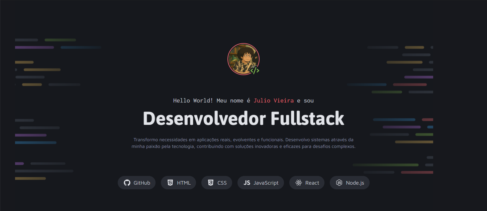

<h1 align="center"> Portfólio Dev </h1>

Portfólio de um dev fictício feito como forma de estudos do curso Fullstack da Rocketseat

<a href="#-tecnologias">Tecnologias</a>&nbsp;&nbsp;&nbsp; |&nbsp;&nbsp;&nbsp;&nbsp;
<a href="#-projeto">Projeto</a>&nbsp;&nbsp;&nbsp;|&nbsp;&nbsp;&nbsp;
<a href="#-layout">Layout</a>&nbsp;&nbsp;&nbsp;|&nbsp;&nbsp;&nbsp;
<a href="#-learning">Aprendizados</a>

## 🚀 Tecnologias

Esse projeto foi desenvolvido com as seguintes tecnologias:

- HTML e CSS
- Git e Github
- FIGMA

## 💻 Projeto

O Portfólio Dev é um portfólio fictício de um desenvolvedor, onde apresentei todas as tecnologias que ele aprendeu, além dos projetos em que trabalhou. Todos os links foram inseridos com "#" apenas como ilustrativos, já que se trata de um perfil fictício. Ainda assim, a criação desse portfólio me permitiu expandir meus conhecimentos em diversas áreas.

## 📚Aprendizados

Este projeto foi desenvolvido como parte de um desafio do módulo "Avançando no CSS", no curso de Fullstack da Rocketseat. Durante sua construção, tive a oportunidade de aprofundar meus conhecimentos em CSS, especialmente no uso de CSS Grid para criar layouts mais organizados, responsivos e com melhor aproveitamento do espaço na tela. A experiência foi fundamental para entender na prática como estruturar elementos de forma eficiente utilizando técnicas modernas de estilização.

